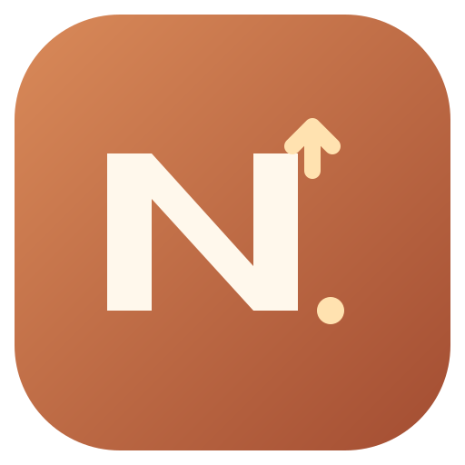

<p align="center"></p>
<h1 align="center">Nekox OSS Tool</h1>
<p align="center">A small, focused personal desktop companion for Alibaba Cloud OSS.</p>
<p align="center"><a href="README.md">中文</a> · English · <a href="https://github.com/qhqj/nekox-oss-tool/releases/latest">Download</a></p>

## Install

Download `Nekox-OSS-Tool-VERSION-windows-x64-setup.exe` from [Releases](https://github.com/qhqj/nekox-oss-tool/releases). The per-user installer supports Simplified Chinese and English and lets you choose an installation directory.

- Targets Windows 10 / 11 x64. Microsoft Edge WebView2 is required; the installer downloads it if missing.
- Builds are currently unsigned. Windows may show an unknown-publisher warning.
- The application UI is Chinese. The English documentation and installer do not imply an English application UI.

## Features

- Configure Region, Bucket, AccessKey, optional STS Token, Endpoint and public base URL. Paste an OSS hostname to detect the Bucket and Region.
- Browse object prefixes using `delimiter=/`, up to 300 entries per page, displaying names and sizes only.
- Named accounts with notes, independent AccessKey / STS configurations and switching. Failed switches retain the current connection.
- Upload multiple files or select a folder recursively, preserving its root name and subdirectories under the current prefix. Empty folders do not create objects.
- Resolve conflicts with overwrite, skip or automatic `name (n).ext` renaming; optionally apply the choice to remaining conflicts in the current run.
- Queue progress, per-file final Key and public URL, failed-item retries and pause after the current file.
- Multipart uploads for files of 8 MiB or larger, with progress and result details.
- Copy public URLs, preview images on click, and download on demand with a desktop save dialog.
- Remember personal connection settings and attempt to reconnect on startup.
- Warm styling, a consistent application icon and native window controls. No business backend, automatic thumbnails or delete operations.

## Connect

1. Enter your Region, Bucket and AccessKey ID / Secret. Include the STS Token when using temporary credentials.
2. Connect, browse a prefix, then upload, copy a link or download.
3. Public links require anonymously readable objects or a publicly accessible CDN base URL. Private downloads use short-lived signed URLs.

Windows stores the account vault in `accounts-v1.dpapi` in the local application data directory, encrypted with **DPAPI for the current Windows user**. Legacy single-account WebView settings are removed after successful migration. Encryption does not protect against other programs running with the same Windows user's privileges. The vault is not a portable cross-user backup. Source code and installers contain no real credentials; expired STS credentials must be entered again.

Web development previews persist only nonsecret profile metadata; Secret and STS Token remain in the current page session and must be reentered after refresh. Long-lived AccessKey connections are intended for trusted local/intranet use; public deployments should use STS. Removing an account only removes local settings, never OSS objects. Account and directory switching are locked while an upload dialog is open.

OSS requests originate directly from the WebView, so Bucket CORS settings may still be required. Allow the actual Origin reported in connection errors, the required GET / PUT / POST / HEAD methods and request headers, and expose response headers such as `ETag` and `x-oss-request-id`. Give a dedicated RAM identity only the necessary Bucket listing, read, write and multipart permissions for your upload workflow.

Conflict checks use ListObjectsV2, without reading object content. Uploads that were not explicitly approved for overwrite send `x-oss-forbid-overwrite`. OSS ignores this header for buckets with versioning enabled or suspended, so concurrent conflicts remain a limitation there; see [Alibaba Cloud documentation](https://help.aliyun.com/zh/oss/developer-reference/prevent-objects-from-being-overwritten-by-objects-with-the-same-names). The upload queue is sequential; pause waits for the current file. Queue state is not retained after closing the dialog. Downloads buffer the entire file in memory and are limited by available memory.

## Develop and build

Requirements: Node.js 22+, stable Rust MSVC, Visual Studio C++ Build Tools and WebView2. Built with Vue 3, Vite, TypeScript, the ali-oss Browser SDK and Tauri 2.

```bash
npm ci
npm run dev:desktop
```

```bash
npm run typecheck
npm test
npm run build
npm run build:desktop
```

NSIS output: `src-tauri/target/release/bundle/nsis/`. Local installer copies and checksums are in the Git-ignored `install/` directory. `powershell -ExecutionPolicy Bypass -File scripts/package-desktop.ps1` discovers a project-local Rust toolchain when available, runs native tests and creates the installer plus SHA-256. Use `npm run dev` only for frontend development previews. Automated OSS tests use mocked requests and synthetic credentials, not a live Bucket.

Regenerate application icons from the editable vector source:

```bash
npx tauri icon public/app-icon.svg
```

## Releases

`.github/workflows/release.yml` runs Windows type checks, frontend and NSIS builds on `v*` tags, then publishes the installer and SHA-256 checksums to GitHub Releases. Keep the application version consistent in `package.json`, `package-lock.json`, `src-tauri/Cargo.toml`, `src-tauri/Cargo.lock` and `src-tauri/tauri.conf.json` before tagging.

```bash
git push origin main
git tag v0.2.0
git push origin v0.2.0
```

Use a new version and tag for subsequent releases. This workflow does not add automatic in-app updates.
