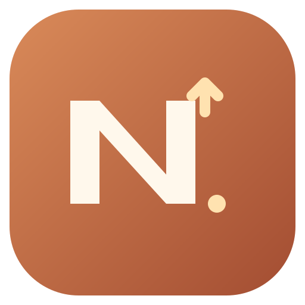

<p align="center"></p>
<h1 align="center">Nekox OSS Tool</h1>
<p align="center">A small, focused personal desktop companion for Alibaba Cloud OSS.</p>
<p align="center"><a href="README.md">中文</a> · English · <a href="https://github.com/qhqj/nekox-oss-tool/releases/latest">Download</a></p>

## Install

Download `Nekox-OSS-Tool-VERSION-windows-x64-setup.exe` from [Releases](https://github.com/qhqj/nekox-oss-tool/releases). The per-user installer supports Simplified Chinese and English and lets you choose an installation directory.

- Targets Windows 10 / 11 x64. Microsoft Edge WebView2 is required; the installer downloads it if missing.
- Builds are currently unsigned. Windows may show an unknown-publisher warning.
- The application UI is Chinese. The English documentation and installer do not imply an English application UI.

## Features

- Configure Region, Bucket, AccessKey, optional STS Token, Endpoint and public base URL. Paste an OSS hostname to detect the Bucket and Region.
- Browse object prefixes using `delimiter=/`, up to 300 entries per page, displaying names and sizes only.
- Named accounts with notes, independent AccessKey / STS configurations and switching. Failed switches retain the current connection.
- Upload multiple files or select a folder recursively, preserving its root name and subdirectories under the current prefix. Empty folders do not create objects.
- Resolve conflicts with overwrite, skip or automatic `name (n).ext` renaming; optionally apply the choice to remaining conflicts in the current run.
- Queue progress, per-file final Key and public URL, failed-item retries, immediate transfer cancellation and in-dialog multipart recovery.
- Multipart uploads for files of 8 MiB or larger, with progress and result details.
- Copy public URLs, preview images on click, and download on demand. Windows selects a new destination before streaming, with received-byte progress and cancellation.
- Remember nonsecret account settings; reenter Secret / STS Token after restart.
- Warm styling, a consistent application icon and native window controls. No business backend, automatic thumbnails or delete operations.

## Connect

1. Enter your Region, Bucket and AccessKey ID / Secret. Include the STS Token when using temporary credentials.
2. Connect, browse a prefix, then upload, copy a link or download.
3. Public links require anonymously readable objects or a publicly accessible CDN base URL. Private downloads use short-lived signed URLs.

Windows stores nonsecret account metadata in `accounts-v1.dpapi`, encrypted with **DPAPI for the current Windows user**. Secret and STS Token remain in session memory; their saved vault fields are empty. Credentials in older encrypted vaults are not restored, and loading alone does not rewrite those vaults. The next successful account save removes previously stored credentials. At runtime, legacy single-account WebView credentials migrate into the current session; the old plaintext entry is removed only after metadata is saved successfully. The vault is not a portable cross-user backup. Reenter credentials after restart or STS expiration.

Web development previews persist only nonsecret profile metadata; Secret and STS Token remain in the current page session and must be reentered after refresh. Long-lived AccessKey connections are intended for trusted local/intranet use; public deployments should use STS. Removing an account only removes local settings, never OSS objects. Account and directory switching are locked while an upload dialog is open.

Endpoint and public base URL must use HTTPS; bare hostnames are normalized to HTTPS. Endpoints accept no path; public URLs may contain a CDN path prefix. Both reject URL credentials, query parameters and fragments. No Bucket CORS or RAM permissions are changed automatically.

OSS requests originate directly from the WebView, so Bucket CORS settings may still be required. Allow the actual Origin reported in connection errors, the required GET / PUT / POST / HEAD methods and request headers, and expose response headers such as `ETag` and `x-oss-request-id`. Give a dedicated RAM identity only the necessary Bucket listing, read, write and multipart permissions for your upload workflow.

Conflict checks use ListObjectsV2, without reading object content. Uploads that were not explicitly approved for overwrite send `x-oss-forbid-overwrite`. OSS ignores this header for buckets with versioning enabled or suspended, so concurrent conflicts remain a limitation there; see [Alibaba Cloud documentation](https://help.aliyun.com/zh/oss/developer-reference/prevent-objects-from-being-overwritten-by-objects-with-the-same-names). The queue is sequential with at most four parallel parts. Pause aborts this transfer's isolated SDK client and fetch requests; late callbacks are ignored. Queue/checkpoints are discarded when the dialog closes, the page refreshes or the app restarts.

The overwrite guard reaches PUT and both multipart initiation and completion. Server name conflicts allow at most five write attempts; renaming never reuses a server-rejected Key even if listing still reports it absent. Other network errors do not trigger automatic full-file retries.

Checkpoints stay in memory without credentials and bind to the account, Bucket, Region, Endpoint, Prefix, resolved Key and exact File identity. Changing a target/file rejects reuse; remove and reselect to edit a previously attempted filename. Recovery checks object existence again without querying remote parts or reading object content. A multipart timeout with a checkpoint gets at most one automatic recovery attempt within the same five-write budget; expired checkpoints are cleared for a fresh manual retry. Credential expiry/verification failures pause the remaining queue. Replace the same account's credentials manually in the upload dialog, then retry; Secret and STS inputs are passwords, with no persistence, STS refresh service or immediate validation request.

Cancellation cannot roll back requests OSS already accepted. It never deletes completed objects or remote unfinished parts, calls AbortMultipartUpload/DELETE, or adds RAM permissions. Unfinished parts may incur storage charges; use your existing OSS policies to handle them. A completed object found on recovery still follows the conflict decision. Installed SDK cancellation/recovery is tested in a real Tauri WebView using synthetic transport; live Bucket/CORS and physical network interruptions remain unverified. See [ali-oss multipart recovery](https://github.com/ali-sdk/ali-oss#multipartuploadname-file-options).

Upload clients disable generic SDK network retries. The SDK's recursive clock-skew correction is limited to one retry per request; further failures prompt manual clock correction.

Windows opens the native save dialog before signing or fetching. Cancelling selection sends no GET. Choose a new filename: existing files are never replaced, including a destination created during transfer. The WebView streams the five-minute signed URL into an exclusive temporary file using binary IPC chunks of at most 128 KiB, awaiting each disk write before reading more. No full-file `arrayBuffer` or Blob is created; network/WebView buffering still exists, so total process memory is not guaranteed constant. Account switching remains locked, while directory navigation and the persistent download cancellation bar remain available.

Native commands select the destination themselves and return only a task ID; the frontend cannot supply write/delete paths. Cleanup uses the owned file handle, and final rename refuses replacement. Directory names along the canonical path are held stable with zero-access handles until completion/cancellation, temporarily preventing moves. Temporary files are marked for deletion on close during transfer. A forced termination during the short final commit window may leave this task's `.nekox-download-*.part`; inspect it after closing the app. No automatic scan or wildcard cleanup runs. Unsupported directory locking/filesystem behavior fails safely, without administrator access. Windows 10/11 is the supported target; network drives, other filesystems and non-Windows desktop behavior have not been tested.

Web downloads use the short-lived HTTPS attachment URL directly; the browser owns destination, transfer and cancellation. A handoff message does not claim successful saving. Signed URLs are not logged or stored; desktop requests reject redirects and browser links use `noopener noreferrer`. No HEAD, automatic GET, backend, native networking dependency or additional RAM permission is introduced. The generic `fs:allow-write-file` permission from the first milestone is removed. See [Tauri raw IPC](https://v2.tauri.app/develop/calling-rust/#accessing-raw-request), [Windows handle-based rename](https://learn.microsoft.com/en-us/windows/win32/api/winbase/ns-winbase-file_rename_info) and [delete-on-close disposition](https://learn.microsoft.com/en-us/windows/win32/api/winbase/ns-winbase-file_disposition_info).

## Develop and build

Requirements: Node.js 22+, stable Rust MSVC, Visual Studio C++ Build Tools and WebView2. Built with Vue 3, Vite, TypeScript, the ali-oss Browser SDK and Tauri 2.

```bash
npm ci
npm run dev:desktop
```

```bash
npm run typecheck
npm test
npm run build
npm run build:desktop
```

NSIS output: `src-tauri/target/release/bundle/nsis/`. Local installer copies and checksums are in the Git-ignored `install/` directory. `powershell -ExecutionPolicy Bypass -File scripts/package-desktop.ps1` discovers a project-local Rust toolchain when available, runs native tests and creates the installer plus SHA-256. Use `npm run dev` only for frontend development previews. Automated OSS tests use mocked requests and synthetic credentials, not a live Bucket.

For a build check that does not load local `.env` files, run `npm run build -- --config tests/build.config.ts`. Vitest also disables `.env` loading.

With the existing Windows toolchain and a repository on D:, run `powershell -NoProfile -ExecutionPolicy Bypass -File scripts/test-desktop.ps1` for isolated Tauri/WebView offline acceptance. Synthetic account storage, browser profile, downloads and temporary files stay under a fresh `test-results/desktop-<guid>` directory. It verifies upload cancellation/recovery, late callbacks, session credentials, save-dialog cancellation with zero requests, chunked download, failure cleanup and no overwrite. It controls only the test process's native dialogs and runs as a normal Windows user without persistent policy changes, real account storage, OSS access, installation or release. See the [test instructions](tests/desktop/README.md).

Regenerate application icons from the editable vector source:

```bash
npx tauri icon public/app-icon.svg
```

## Releases

`.github/workflows/release.yml` runs Windows type checks, frontend and NSIS builds on `v*` tags, then publishes the installer and SHA-256 checksums to GitHub Releases. Keep the application version consistent in `package.json`, `package-lock.json`, `src-tauri/Cargo.toml`, `src-tauri/Cargo.lock` and `src-tauri/tauri.conf.json` before tagging.

```bash
git push origin main
git tag v0.2.0
git push origin v0.2.0
```

Use a new version and tag for subsequent releases. This workflow does not add automatic in-app updates.
